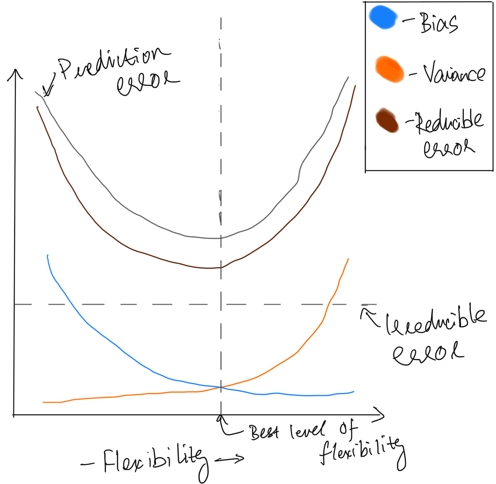
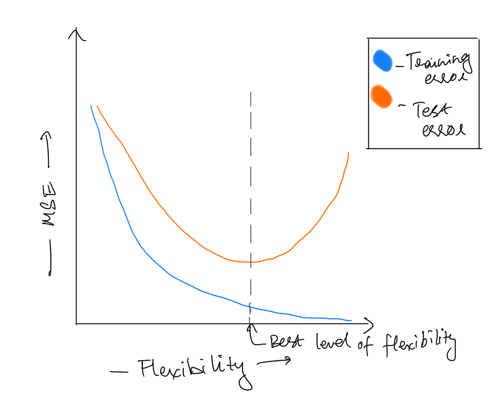

## 1. Suppose that you are interested in performing regression on a particular dataset, in order to answer a particular scientific question. You need to decide whether to take a parametric or a non-parametric approach.

### (a) In general, what are the pros and cons of taking a parametric versus a non-parametric approach?

|      |Parametric model | Non-parametric model|
|---   |-----------------|---------------------|
|Pros  | - Simplifies the problem from estimating a high-dimensional function to represent $f$ to a set of parameters <br> - Interpretability of the model is easier using parameters| - Does not assume a functional form of $f$, making it easier to fit a wider range of possible shapes for $f$ <br> - Performs well when statistical inference is not a concern, flexibility is high|
|Cons  | - The model may not be a close estimate of the true form of $f$. Hence if it is too far off from the true $f$, our estimate will be poor| - Requires a large number of observations in comparison to the number of features <br> - While flexibility is high, interpretability is low for these models|

### (b) What properties of the data or scientific question would lead you to take a parametric approach?
1. Requirement of model interpretability: If the scientific question requires the ability to explain the relation between the response and predictors and to make statistical inferences, we should prefer parametric methods

2. Limited number of data points: If we do not have a higher number of observations, parametric methods may perform better than non-parametric methods

### (c) What properties of the data or scientific question would lead you to take a non-parametric approach?
1. High number of data points: If we have a much larger number of observations than features in the data, we can use parametric methods

2. Requirement of model accuracy: If we are more concerned about model accuracy and do not care for interpretability, non-parametric methods can create complex models that closely estimate the true $f$.

## 2. In each setting, would you generally expect a flexible or an inflexible statistical machine learning method to perform better? Justify your answer.

### (a) Sample size n is very small, and number of predictors p is very large.

**Inflexible will be better**. If we use a flexible model, it will overfit the training data and hence perform worse than an inflexible model on the test data.

### (b) Sample size n is very large, and number of predictors p is very small.

**Flexible will be better**. A flexible model with a large number of observations will better estimate $f$ and the large number of observations will allow the model to generalize better for unknown data, provided that the training data is representative of the data distribution.

### (c) Relationship between predictors and response is highly non-linear.

**Flexible will be better**. A flexible model will be able to create a better estimate of the non-linearity between the response and the predictors. Inflexible methods will constrain the shapes that the estimated model can take on thereby not being able to represent this non-linearity as well as a flexible model.

### (d) The variance of the error terms, i.e. $\sigma^2 = Var(\epsilon)$, is extremely high.

**Inflexible will be better**. If the variance of the error terms is high, that means we are running into an overfitting problem, i.e. the model is a good estimator for the training data but not so much for the test data. Using an inflexible approach will help the model better generalize the underlying relationship in the test set.

## 3. For each scenario, determine whether it is a regression or a classification problem, determine whether the goal is inference or prediction, and state the values of n (sample size) and p (number of predictors).

### (a) I want to predict each student’s final exam score based on their homework scores. There are 50 students enrolled in the course, and each student has completed 8 homeworks.

- *Problem:* Regression
- *Goal:* Prediction
- *n:* 50
- *p:* 8

### (b) I want to understand the factors that contribute to whether or not a student passes this course. The factors that I consider are (i) whether or not the student has previous programming experience; (ii) whether or not the student has previously studied linear algebra; (iii) whether or not the student has taken a previous stats/probability course; (iv) whether or not the student attends office hours; (v) the student’s overall GPA; (vi) the student’s year (e.g. freshman, sophomore, junior, senior, or grad student). I have data for all 50 students enrolled in the course.

- *Problem:* Classification
- *Goal:* Inference
- *n:* 50
- *p:* 6

## 4. This problem has to do with the bias-variance trade-off and related ideas, in the context of regression. For (a) and (b), it’s okay to submit hand-sketched plots: you are not supposed to actually compute the quantities referred to below on data; instead, this is a thought exercise.

### (a) Make a plot, like the one we saw in class, with “flexibility” on the x-axis. Sketch the following curves: squared bias, variance, irreducible error, reducible error, expected prediction error. Be sure to label each curve. Indicate which level of flexibility is “best”.

{width=60%}

### (b) Make a plot with “flexibility” on the x-axis. Sketch curves corresponding to the training error and the test error. Be sure to label each curve. Indicate which level of flexibility is “best”.

{width=60%}

### (c) Describe an $\hat{f}$ that has extremely low bias, and extremely high variance. Explain your answer.
An $\hat{f}$ that passes very closely through each point in the training data will have extremely low bias and extremely high variance. This is because the bias is the difference between the true value and estimated value (which in this case will be low for the model we describe). The variance will be high because for a different training set, the $\hat{f}$ will look very different, as it depends highly on what training data is observed.

### (d) Describe an $\hat{f}$ that has extremely high bias, and zero variance. Explain your answer.
A model that only has a randomly selected intercept value would have extremely high bias and zero variance. Bias would be extremely high because the model will have estimates that are way off from the true values. Variance will be zero because the model always returns a single value for $\hat{f}(X_0)$ no matter what the value of $X_0$ is. Hence, $Var(\hat{f}(X_0)) = 0$.

## 5. We now consider a classification problem. Suppose we have 2 classes (labels), 25 observations per class, and p = 2 features. We will call one class the “red” class and the other class the “blue” class. The observations in the red class are drawn i.i.d. from a $N_p(\mu_r, I)$ distribution, and the observations in the blue class are drawn i.i.d. from a $N_p(\mu_b, I)$ distribution, where $\mu_r = \binom{0}{0}$ is the mean in the red class, and where $\mu_b = \binom{1.5}{1.5}$ is the mean in the blue class.

### (a) Generate a training set, consisting of 25 observations from the red class and 25 observations from the blue class. (You will want to use the R function rnorm.) Plot the training set. Make sure that the axes are properly labeled, and that the observations are colored according to their class label.

```{r}
set.seed(558)

x.train.red <- matrix(rnorm(50), nrow = 25, ncol = 2)
x.train.blue <- matrix(rnorm(50, mean = 1.5), nrow = 25, ncol = 2)

x.train <- data.frame(rbind(x.train.red, x.train.blue), 
                      class = c(rep("red",25),rep("blue", 25)),
                      stringsAsFactors = TRUE)

library(ggplot2)

color.names <- levels(x.train$class)
names(color.names) <- color.names 
color.scale.gg <- scale_color_manual(name = "Class", values=color.names)

ggplot(data = x.train, aes(x=X1, y=X2, color=class)) +
  geom_point() +
  color.scale.gg +
  ggtitle("Scatterplot of training set")
```
```{r, echo=FALSE}
#cleanup
rm(x.train.red, x.train.blue)
```

### (b) Now generate a test set consisting of 25 observations from the red class and 25 observations from the blue class. On a single plot, display both the 2 training and test set, using one symbol to indicate training observations (e.g. circles) and another symbol to indicate the test observations (e.g. squares). Make sure that the axes are properly labeled, that the symbols for training and test observations are explained in a legend, and that the observations are colored according to their class label.

```{r}
x.test.red <- matrix(rnorm(50), nrow = 25, ncol = 2)
x.test.blue <- matrix(rnorm(50, mean = 1.5), nrow = 25, ncol = 2)

x.test <- data.frame(rbind(x.test.red, x.test.blue), 
                     class = c(rep("red",25), rep("blue", 25)), 
                     stringsAsFactors = TRUE)

shape.scale.gg <- scale_shape_manual("Dataset", values = c("training"=19, "test"=1))

ggplot() +
  geom_point(data = x.train, aes(x=X1, y=X2, color = class, shape = "training")) +
  geom_point(data = x.test, aes(x=X1, y=X2, color = class,  shape = "test")) +
  color.scale.gg +
  shape.scale.gg +
  ggtitle("Scatterplot of training and test dataset")
```
```{r, echo=FALSE}
#cleanup
rm(x.test.red, x.test.blue)
```

### (c) Using the knn function in the library class, fit a k-nearest neighbors model on the training set, for a range of values of k from 1 to 20. Make a plot that displays the value of 1/k on the x-axis, and classification error (both training error and test error) on the y-axis. Make sure all axes and curves are properly labeled. Explain your results.

```{r}
library(class)

K <- seq(1,20)

y.train <- x.train[, c(3)]
x.train <- x.train[,-c(3)]

y.test <- x.test[, c(3)]
x.test <- x.test[, -c(3)]

compute.knn.metrics <- function(k){
  train.knn <- knn(train = x.train, test = x.train, cl = y.train, k = k)
  test.knn <- knn(train = x.train, test = x.test, cl = y.train, k = k)
  
  train.err <- 1 - length(which(train.knn == y.train))/nrow(x.train)
  test.err <- 1 - length(which(test.knn == y.test))/nrow(x.test)
  
  return(c(train.err, test.err, k, test.knn))
}

results <- t(sapply(K, function(k) compute.knn.metrics(k)))
error.results <- data.frame(results[,c(1:3)])
names(error.results) <- c("training.error", "test.error", "k")

ggplot(data = error.results, aes(x = 1/k)) +
  geom_line(aes(y=training.error, color="Training Error")) +
  geom_line(aes(y=test.error, color="Test Error")) +
  labs(y = "Error Rate", title = "Plot of training and test errors for KNN", 
       subtitle = "Range of K = [1,20]") +
  theme(legend.title = element_blank()) 
```

We see from the graph that, as k decreases (1/k increases), the training error drops eventually to 0, however the corresponding test error increases. k = 1 is an example of a highly flexible model, and the graph depicts the problem with more flexibility - the tendency to overfit training data.

This can also be a sign that a highly flexible or non-linear model is not as good a fit than less flexible models, as we see a steadily rising test error as the value of k decreases.

### (d) For the value of k that resulted in the smallest test error in part (c) above, make a plot displaying the test observations as well as their true and predicted class labels. Make sure that all axes and points are clearly labeled.

```{r}
min.k <- which(error.results$test.error == min(error.results$test.error))
#Above value turns out to be 10
print(min.k)

predictions <- as.factor(results[min.k, -c(1:3)])
levels(predictions) <- levels(y.test)
best.test.result <- data.frame(x.test, y.test, predictions)

shape.scale.gg <- scale_shape_manual("Predicted class", 
                                     values = c("blue"=1,"red"=19)) 

ggplot(data = best.test.result, aes(x = X1, y = X2, color = y.test, 
                                    shape = predictions)) +
  geom_point() +
  color.scale.gg +
  shape.scale.gg +
  ggtitle("Scatterplot of true and predicted class for test set",
          subtitle = "Using KNN with K = 10")
```
```{r, echo=FALSE}
#Cleanup
rm(list = ls()[!ls() %in% c("color.scale.gg","shape.scale.gg","compute.knn.metrics")])
```

### (e) Recall that the Bayes classifier assigns an observation to the red class if $Pr(Y = red|X = x) > 0.5$, and to the blue class otherwise. The Bayes error rate is the error rate associated with the Bayes classifier. What is the value of the Bayes error rate in this problem? Explain your answer.

We will calculate the euclidean distance of each point from the mean of the two distributions i.e. $\mu_r = \binom{0}{0}$ and $\mu_b = \binom{1.5}{1.5}$ and assign the class to the observation whose mean is closest to it. We do this because the $P(Y = red | X) > 0.5$ for a point that is closer to $\mu_r = \binom{0}{0}$ and the same for Y=blue and $\mu_b$.

We can make the above assumption because both distributions are symmetric normal distributions with equal variances,hence the decision boundary is a straight line equidistant from both clusters.

We simulate a large number of test observations from the two distributions and apply the above described process to calculate the Bayes error rate.

```{r}
x.sim.red <- matrix(rnorm(1e6), nrow = 0.5e6, ncol = 2)
x.sim.blue <- matrix(rnorm(1e6, mean = 1.5), nrow = 0.5e6, ncol = 2)

x.sim <- data.frame(rbind(x.sim.red, x.sim.blue), 
                    class = c(rep("red",0.5e6), rep("blue", 0.5e6)), 
                    stringsAsFactors = TRUE)

bayes.classifer <- function(x) {
  x$dist.red <- sqrt((x.sim[,1] - 0)^2 + (x.sim[,2] - 0)^2)
  x$dist.blue <- sqrt((x.sim[,1] - 1.5)^2 + (x.sim[,2] - 1.5)^2) 
  
  x$predicted <- ifelse(x$dist.red < x$dist.blue, "red", "blue")
  levels(x$predicted) <- levels(x$class)
  
  err <- 1-length(which(x$class == x$predicted))/nrow(x)
  
  return(err)
}

bayes.error <- bayes.classifer(x.sim)
cat("Error rate of Bayes classifier = ", bayes.error)
```
```{r, echo=FALSE}
#Cleanup
rm(list = ls()[!ls() %in% c("color.scale.gg","shape.scale.gg","compute.knn.metrics")])
```

## 6. We will once again perform k-nearest-neighbors in a setting with p = 2 features. But this time, we’ll generate the data differently: let $X_1 \sim Unif[0, 1]$ and $X_2 \sim Unif[0, 1]$, i.e. the observations for each feature are i.i.d. from a uniform distribution. An observation belongs to class “red” if $(X_1 - 0.5)^2 + (X_2 - 0.5)^2 > 0.15$ and $X_1 > 0.5$; to class “green” if $(X_1 - 0.5)^2 + (X_2 - 0.5)^2 > 0.15$ and $X_1 \le 0.5$; and to class “blue” otherwise.

```{r}
assign.class <- function(x1,x2) {
  if(((x1-0.5)^2 + (x2-0.5)^2) > 0.15 && x1 > 0.5){
    return("red")
  }
  else if(((x1-0.5)^2 + (x2-0.5)^2) > 0.15 && x1 <= 0.5){
    return("green")
  }
  else{
    return("blue")
  }
}
```

### (a) Generate a training set of n = 200 observations. (You will want to use the R function runif.) Plot the training set. Make sure that the axes are properly labeled, and that the observations are colored according to their class label.

```{r}
set.seed(558)

x.mat <- matrix(runif(400), ncol = 2)
y.train <- as.factor(apply(x.mat, MARGIN = 1, function(x) assign.class(x[1], x[2])))

x.train <- data.frame(x.mat, class = y.train)

color.names <- levels(x.train$class)
names(color.names) <- color.names 
color.scale.gg <- scale_color_manual(name = "Class", values=color.names)

ggplot(data = x.train, aes(x=X1, y=X2, color=class)) +
  geom_point() +
  color.scale.gg +
  ggtitle("Scatterplot of training set")
```

```{r, echo=FALSE}
#cleanup
rm(x.mat)
```

### (b) Now generate a test set consisting of another 200 observations. On a single plot, display both the training and test set, using one symbol to indicate training observations (e.g. circles) and another symbol to indicate the test observations (e.g. squares). Make sure that the axes are properly labeled, that the symbols for training and test observations are explained in a legend, and that the observations are colored according to their class label.

```{r}
x.mat <- matrix(runif(400), ncol = 2)
y.test <- as.factor(apply(x.mat, MARGIN = 1, function(x) assign.class(x[1], x[2])))

levels(y.test) <- levels(y.train)

x.test <- data.frame(x.mat, class = y.test)

shape.scale.gg <- scale_shape_manual("Dataset", values = c("training"=19, "test"=1))

ggplot() +
  geom_point(data = x.train, aes(x=X1, y=X2, color = class, shape = "training")) +
  geom_point(data = x.test, aes(x=X1, y=X2, color = class,  shape = "test")) +
  color.scale.gg +
  shape.scale.gg +
  ggtitle("Scatterplot of training and test dataset")
```

```{r, echo=FALSE}
#cleanup
rm(x.mat)
```

### (c) Using the knn function in the library class, fit a k-nearest neighbors model on the training set, for a range of values of k from 1 to 50. Make a plot that displays the value of 1/k on the x-axis, and classification error (both training error and test error) on the y-axis. Make sure all axes and curves are properly labeled. Explain your results.

```{r}
K <- seq(1,50)

x.train <- x.train[,-c(3)]
x.test <- x.test[,-c(3)]

results <- t(sapply(K, function(k) compute.knn.metrics(k)))
error.results <- data.frame(results[,c(1:3)])
names(error.results) <- c("training.error", "test.error", "k")

ggplot(data = error.results, aes(x = 1/k)) +
  geom_line(aes(y=training.error, color="Training Error")) +
  geom_line(aes(y=test.error, color="Test Error")) +
  labs(y = "Error Rate", title = "Plot of training and test errors for KNN", 
       subtitle = "Range of K = [1,50]") +
  theme(legend.title = element_blank()) 
```

We see that for larger values of k (lower 1/k), the training and test error are very high. As the value of k decreases, model flexibility increases and such models are a better fit for the data. We can guess from the scatter plot that the decision boundary is likely to be non-linear and this is reflected in the above graph too as more flexible models (lower k) have lower test error than less flexible models (higher k).

The reason why the smallest value of k is still not the best model is because of overfitting. The model is highly tuned for the training data but not so much for the test data.

### (d) For the value of k that resulted in the smallest test error in part (c) above, make a plot displaying the test observations as well as their true and predicted class labels. Make sure that all axes and points are clearly labeled.

```{r}
min.k <- which(error.results$test.error == min(error.results$test.error))
print(min.k)

predictions <- as.factor(results[min.k, -c(1:3)])
levels(predictions) <- levels(y.test)
best.test.result <- data.frame(x.test, y.test, predictions)

shape.scale.gg <- scale_shape_manual("Predicted class", 
                                     values = c("blue"=1, "green"= 4, "red"=19)) 

ggplot(data = best.test.result, aes(x = X1, y = X2, color = y.test, 
                                    shape = predictions)) +
  geom_point() +
  color.scale.gg +
  shape.scale.gg +
  ggtitle("Scatterplot of true and predicted class for test set",
          subtitle = "Using KNN with K = 11") 
```

### (e) In this example, what is the Bayes error rate? Justify your answer, and explain how it relates to your findings in (c) and (d).
In this example, the Bayes error rate would be 0. This is because, the Bayes classifier, which is the ideal classifier would be the equations that we used to assign the classes to our training and test sets. We know that $P(Y = red | X) = 1$ if $(X_1 - 0.5)^2 + (X_2 - 0.5)^2 > 0.15$ and $X_1 > 0.5$, $P(Y = green | X) = 1$ if $(X_1 - 0.5)^2 + (X_2 - 0.5)^2 > 0.15$ and $X_1 \le 0.5$ and $P(Y = blue | X) = 1$ if $(X_1 - 0.5)^2 + (X_2 - 0.5)^2 \le 0.15$. Using this information, we can always classify all our observations perfectly.

In (d) we can see that the misclassifications are only made in cases that are close to the boundary of the circle $(X_1 - 0.5)^2 + (X_2 - 0.5)^2 = 0.15$, which is the Bayes decision boundary. From part (c) we see that a smaller value of k, which results in higher model flexibility is able to approximate the non-linear decision boundary. The KNN model is trying to approximate the equation of the circle, and the K value in (d) is the one that comes closest to the true boundary.

```{r, echo=FALSE}
rm(list = ls())
```

## 7. This exercise involves the Boston housing data set, which is part of the ISLR2 library.

### (a) How many rows are in this data set? How many columns? What do the rows and columns represent?

```{r}
library(ISLR2)

cat("Rows = ", dim(Boston)[1])
cat("\nColumns =", dim(Boston)[2])
```

Each row represents a suburb and each column represents a feature of the suburb. A detailed description of the dataset from help documentation:

**Boston Data**

*Description:*
A data set containing housing values in 506 suburbs of Boston.

*Format:*
A data frame with 506 rows and 13 variables.

*Variables:*

- *crim:* per capita crime rate by town.
- *zn:* proportion of residential land zoned for lots over 25,000 sq.ft.
- *indus:* proportion of non-retail business acres per town.
- *chas:* Charles River dummy variable (= 1 if tract bounds river; 0 otherwise).
- *nox:* nitrogen oxides concentration (parts per 10 million).
- *rm:* average number of rooms per dwelling.
- *age:* proportion of owner-occupied units built prior to 1940.
- *dis:* weighted mean of distances to five Boston employment centers.
- *rad:* index of accessibility to radial highways.
- *tax:* full-value property-tax rate per $10,000.
- *ptratio:* pupil-teacher ratio by town.
- *lstat:* lower status of the population (percent).
- *medv:* median value of owner-occupied homes in $1000s.

### (b) Make some pairwise scatterplots of the predictors (columns) in this data set. Describe your findings.

```{r, results='hide', fig.keep='all', message = FALSE}
library(GGally)

ggpairs(data = Boston[,-c(4)], aes(alpha = 0.01), 
        upper = list(continuous = wrap("cor", size = 3))) +
  theme(axis.line=element_blank(),
        axis.text=element_blank(),
        axis.ticks=element_blank())
```

The categorical variable chas has been omitted form this plot as it does not provide useful information. We make a few observations on apparent linear relationships as they are easiest to discern from the plot:

- Highly positive linear relation (based on correlation coefficient and scatter) between 
  - number of rooms per dwelling (rm) and median value of owner occupied homes (medv)
  - lots zoned for 25K sq ft (zn) and weighted distance to 5 Boston employment centers (dis)
  - nitrogen oxide concentration (nox) and proportion of owner occupied units built before 1940 (age)
  - full value property tax per $10K (tax) and proportion of non-retail establishments (indus)
  - crime rate (crim) and accessibility to radial highways (rad)
  
- Highly negative linear relation (based on correlation coefficient and scatter) between
  - weighted distance to 5 Boston employment centers (dis) and proportion of non-retail establishments (indus)
  - weighted distance to 5 Boston employment centers (dis) and nitrogen oxide concentration (nox)
  - lower status of the population (percent) (lstat) and number of rooms per dwelling (rm)
  - weighted distance to 5 Boston employment centers (dis) and proportion of owner occupied units built before 1940 (age)
  - (lstat) lower status of the population (percent) and median value of owner occupied homes (medv)

### (c) Are any of the predictors associated with per capita crime rate? If so, explain the relationship.

Yes, per capita crime rate is related to other variables in the data as follows:

- Increases with decrease in lots zoned for 25K sq ft(zn), weighted distance to 5 Boston employment centers (dis), median value of owner occupied homes (medv)
- Increases with increase in nitrogen oxide concentration (nox), proportion of homes built before 1940 (age), property tax rate (tax), pupil-teacher ratio (ptratio), lower status of the population (percent) (lstat)
- Increases with decrease in rooms per dwelling (rm) up to a certain point and then starts increasing with some outlier observations

### (d) Do any of the suburbs of Boston appear to have particularly high crime rates? Tax rates? Pupil-teacher ratios? Comment on the range of each predictor.

```{r}
library(dplyr)

#Summary statistics for top 10 values of crime rate:
Boston |> top_n(10, crim) |> arrange(desc(crim)) |> select(crim) |> 
  summarise(min(crim), mean(crim), max(crim))

#Summary statistics for top 10 values of tax rate:
Boston |> top_n(10, tax) |> arrange(desc(tax)) |> select(tax) |> 
  summarise(min(tax), mean(tax), max(tax))

#Summary statistics for top 10 values of pupil-teacher ratio:
Boston |> top_n(10, ptratio) |> arrange(desc(ptratio)) |> select(ptratio) |> 
  summarise(min(ptratio), mean(ptratio), max(ptratio))

#Summary statistics for crime rate, tax rate and pupil-teacher ratio (entire dataset)
summary(Boston[, c(1,10,11)])
```

We see that the top 10 values for crime rate are much higher than the 75th percentile value. For tax rate, the 10th highest value is the same as the 75th percentile value (data must have a large number of values with 666) and the pupil-teacher ratio is slightly higher than the 75th percentile value.

The range of crime rate is extremely high, with some neighborhoods having less than < 1 crime per capita while others have almost 89 crimes per capita. There is also a lot of contrast in tax rate where some neighborhoods are taxed almost four times as much as the lowest. While the pupil-teacher ratio has a lower numerical range, a load of 10 extra pupils per teacher makes a huge difference to the individual attention a teacher can provide to a pupil.

### (e) How many of the suburbs in this data set bound the Charles river?

```{r}
cat("Number of suburbs bounding the Charles river = ", sum(Boston$chas))
```

### (f) What are the mean and standard deviation of the pupil-teacher ratio among the towns in this data set?

```{r}
cat("Mean of ptratio = ", mean(Boston$ptratio))
cat("SD of ptratio = ", sd(Boston$ptratio))
```

### (g) Which suburb of Boston has highest median value of owner-occupied homes? What are the values of the other predictors for that suburb, and how do those values compare to the overall ranges for those predictors? Comment on your findings.

```{r, results='asis'}
#Data for towns with highest median value of owner occupied homes
knitr::kable(Boston |> filter(medv == max(medv)))
```

There are 16 suburbs with the highest median value of owner occupied homes.

```{r}
#Summary for towns with highest median value of owner occupied homes
summary(Boston |> filter(medv == max(medv)))
#Summary for entire dataset
summary(Boston)
```

Following is a summary of how the values of other variables compare to the overall ranges for the towns with the highest median value of owner-occupied homes:

- These towns don't have the lowest or highest crime rate. The mean value is lower but the median is higher. It seems like they experience somewhat high crime.
- More proportion of residential land zoned for lots over 25K sq.ft on an average but the maximum is not in this subset of towns
- 37.5% of these towns bound the Charles river
- The mean rooms per dwelling are higher than the overall mean. The maximum is not a part of this subset
- More owner occupied homes are built before 1940 in this subset, half these towns have around 90.2% homes built before 1940
- The weighted distance to 5 Boston employment centers is lower both in terms of mean value and range for this subset
- The tax rates for this subset are higher on average but not the highest in the data
- The pupil-teacher ratio is lower on average for this subset but not the lowest in the data 
- The lower status of the population (percent) is substantially lower for this subset of towns

### (h) In this data set, how many of the suburbs average more than six rooms per dwelling? More than eight rooms per dwelling? Comment on the suburbs that average more than eight rooms per dwelling.

```{r}
cat("Suburbs with more than 6 rooms per dwelling on average = ", 
    length(which(Boston$rm > 6)))
cat("Suburbs with more than 8 rooms per dwelling on average = ", 
    length(which(Boston$rm > 8)))
```

```{r}
summary(Boston |> filter(rm > 8))
```

These suburbs have some of the lowest crime rates, pupil-teacher ratios, proportion of non-retail businesses and lower status of the population (percent) and highest median value of owner occupied homes.