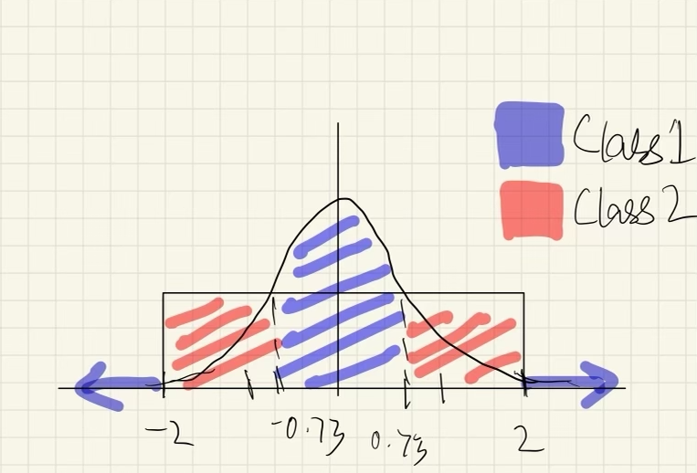

```{r, message=FALSE}
#Import all libraries here
library(ISLR2)
library(knitr)
library(dplyr)
library(MASS)
library(ggplot2)
library(klaR)
```


## 1. In this problem, we will make use of the Auto data set, which is part of the ISLR2 package.

### (a) Fit a least squares linear model to the data, in order to predict mpg using all of the other predictors except for name. Present your results in the form of a table. Be sure to indicate clearly how any qualitative variables should be interpreted.

```{r}
data <- Auto
data <- data |> dplyr::select(-name)
data$origin <- as.factor(data$origin)

model.1a <- lm(mpg ~. , data = data)
kable(summary(model.1a)$coef)
```
The `origin` variable is encoded as - 1. American, 2. European, 3. Japanese. In the above linear model, 1 is set as a reference value. Therefore, the interpretation for the origin coefficients is in comparison to the reference value. The comparisons we can make through these estimates are American vs European and American vs Japanese.

### (b) What is the (training set) mean squared error of this model?

The training MSE can be calculated as the mean of square of model residuals.
```{r}
mean(model.1a$residuals^2)
```

### (c) What gas mileage do you predict for a Japanese car with three cylinders, displacement 100, horsepower of 85, weight of 3000, acceleration of 20, built in the year 1980?

```{r}
predict(model.1a, 
        data.frame(
          origin = as.factor(3),
          cylinders = 3,
          displacement = 100,
          horsepower = 85,
          weight = 3000,
          acceleration = 20,
          year = 80
        ))
```

### (d) On average, holding all other covariates fixed, what is the difference between the mpg of a Japanese car and the mpg of an American car?

Japanese cars have 2.85 MPG more on average than American cars, holding all other variables constant.

### (e) On average, holding all other covariates fixed, what is the change in mpg associated with a 10-unit change in horsepower?

Holding all other variables constant, a 10-unit increase in horsepower will cause a -0.182 unit change (decrease) in MPG.

## 2. Consider using only the origin variable to predict mpg on the Auto data set. In this problem, we will explore the coding of this qualitative variable.

### (a) First, code the origin variable using two dummy (indicator) variables, with Japanese as the default value. Write out an equation like (3.30) in the textbook, and report the coefficient estimates. What is the predicted mpg for a Japanese car? for an American car? for a European car?

```{r}
data$origin <- relevel(data$origin, ref="3")
contrasts(data$origin)
summary(lm(mpg ~ origin, data=data))
```

$$
MPG_i=\begin{cases}
\beta_0+ \varepsilon_i = 30.4506+ \varepsilon_i &\text{if car } i \text{ is Japanese} \\
\beta_0 + \beta_1+ \varepsilon_i = 30.4506 - 10.4172+ \varepsilon_i = 20.0334+ \varepsilon_i&\text{if car } i \text{ is American} \\
\beta_0 + \beta_2+ \varepsilon_i = 30.4506 - 2.8477+ \varepsilon_i = 27.6029+ \varepsilon_i&\text{if car } i \text{ is European}
\end{cases}
$$

### (b) Now, code the origin variable using two dummy (indicator) variables, with American as the default. Write out an equation like (3.30) in the textbook, and report the coefficient estimates. What is the predicted mpg for a Japanese car? for an American car? for a European car?

```{r}
data$origin <- relevel(data$origin, ref="1")
contrasts(data$origin)
summary(lm(mpg ~ origin, data=data))
```

$$
MPG_i=\begin{cases}
\beta_0 + \varepsilon_i = 20.0335+ \varepsilon_i &\text{if car } i \text{ is American}\\
\beta_0 + \beta_1 + \varepsilon_i= 20.0335 + 10.4172+ \varepsilon_i = 30.4507+ \varepsilon_i &\text{if car } i \text{ is Japanese} \\
\beta_0 + \beta_2 + \varepsilon_i= 20.0335 + 7.5695+ \varepsilon_i = 27.603+\varepsilon_i &\text{if car } i \text{ is European}
\end{cases}
$$

### (c) Now, code the origin variable using two variables that take on values of +1 or -1. Write out an equation like (3.30) in the textbook, and report the coefficient estimates. What is the predicted mpg for a Japanese car? for an American car? for a European car?

```{r}
usa <- c(-1,-1)
jpn <- c(1,-1)
eur <- c(-1,1)

mat.temp <- rbind(usa, jpn, eur)
rownames(mat.temp) <- c(1,3,2)
colnames(mat.temp) <- c(3,2)

(contrasts(data$origin) <- mat.temp)
summary(lm(mpg ~ origin, data = data))
```

$$
MPG_i =
\begin{cases}
\beta_0 -\beta_1 -\beta_2 + \varepsilon_i = 29.0268 -5.2086 -3.7847 + \varepsilon_i = 20.0335 + \varepsilon_i &\text{if car } i \text{ is American} \\
\beta_0 + \beta_1 - \beta_2 + \varepsilon_i = 29.0268 + 5.2086 -3.7847 + \varepsilon_i = 30.4507 + \varepsilon_i &\text{if car } i \text{ is Japanese}\\
\beta_0 -\beta_1 + \beta_2 + \varepsilon_i= 29.0268 -5.2086 + 3.7847 + \varepsilon_i = 27.6029 + \varepsilon_i&\text{if car } i \text{ is European}
\end{cases}
$$

### (d) Finally, code the origin variable using a single variable that takes on values of 0 for Japanese, 1 for American, and 2 for European. Write out an equation like (3.30) in the textbook, and report the coefficient estimates. What is the predicted mpg for a Japanese car? for an American car? for a European car?

```{r}

data$origin <- as.numeric(as.character(data$origin))
data$origin.num <- ifelse(data$origin == 3, 0, data$origin)
summary(lm(mpg ~ origin.num, data=data))
```

$$
MPG_i=\begin{cases}
\beta_0 + \varepsilon_i = 25.2395 + \varepsilon_i &\text{if car } i \text{ is Japanese}\\
\beta_0 + \beta_1 + \varepsilon_i  = 25.2395 - 1.8453+ \varepsilon_i =23.3942+ \varepsilon_i &\text{if car } i \text{ is American}\\
\beta_0 + 2\beta_1 + \varepsilon_i = 25.2395 - 2 \times1.8453+ \varepsilon_i = 21.5489+ \varepsilon_i &\text{if car } i \text{ is European}\\
\end{cases}
$$

### (e) Comment on your results in (a)-(d).
In part (a)-(c) the MPG for each value of `origin` remains the same. This is because we use categorical variables, which do not assume order within different values of `origin`. The three different encoding schemes we employ, represent the same data in different forms.

In (d), we find that the results are not consistent with (a)-(c). This is because we treat `origin` as a continuous predictor and imply European is 2x more than American which does not make sense. We could shuffle the encoding scheme and get completely different estimates and suggest a different relationship.

Any categorical variable, that does not have a ordinal scale should be encoded using dummy variables or other categorical encoding schemes.

## 3. Fit a model to predict mpg on the Auto dataset using origin and horsepower, as well as an interaction between origin and horsepower. Present your results, and write out an equation like (3.35) in the textbook. On average, how much does the mpg of a Japanese car change with a one-unit increase in horsepower? How about the mpg of an American car? a European car?

```{r}
data$origin <- as.factor(data$origin)
summary(lm(mpg ~ origin*horsepower, data = data))
```


$$
MPG_i = \beta_0+\beta_3\times horsepower_i+
\begin{cases}
0 & \text{if car }i \text{ is American}\\
\beta_1+\beta_4\times horsepower_i & \text{if car }i \text{ is European}\\
\beta_2+\beta_5\times horsepower_i & \text{if car }i \text{ is Japanese}
\end{cases}
$$

For a 1-unit change in horsepower, we get the change in MPG as:

$$
\Delta MPG_i =
\begin{cases}
\beta_3 = -0.12132 & \text{if car }i \text{ is American}\\
\beta_3+\beta_4= -0.12132 -0.100515 = -0.221835& \text{if car }i \text{ is European}\\
\beta_3+\beta_5= -0.12132 -0.108723 = -0.230043& \text{if car }i \text{ is Japanese}
\end{cases}
$$
```{r, echo=FALSE}
#Cleanup
rm(list = ls())
```

## 4. Consider using least squares linear regression to predict weight (Y) using height.

### (a) Suppose that you measure height in inches ($X_1$), fit the model $Y = \beta_0 + \beta_1X_1 + \varepsilon$, and obtain the coefficient estimates $\hat{\beta}_0 = -165.1$ and $\hat{\beta}_1 = 4.8$. What weight will you predict for an individual who is 64 inches tall?

Predicted weight:
$$
\hat{Y} = \hat{\beta_0} + \hat{\beta_1}X_1 = -165.1 + 4.8\times64 = 142.1
$$

### (b) Now suppose that you want to measure height in feet ($X_2$) instead of inches. (There are 12 inches to a foot.) You fit the model $Y = \beta^*_0 + \beta^*_1X_2 + \varepsilon$. What are the coefficient estimates? What weight will you predict for an individual who is 64 inches tall (i.e. 5.333 feet)?

Since we are dividing the height by 12 (to convert it into feet), we multiply the coefficient by the same amount. Predicted value for weight:
$$
\hat{Y} = \beta_0^* + \beta_1^*X_1 = -165.1+4.8\times12\times5.333 = 142.08
$$
This is only slightly off from (a) due to imprecision in the value 5.333

### (c) Now suppose you fit the model $Y = \beta_0 + \beta_1X_1 + \beta_2X_2 + \epsilon$, which contains both height in inches and height in feet as predictors. Provide a general expression for the least squares coefficient estimates for this model.

Let us assume that the equation using both height in inches and feet is
\begin{equation}
\begin{split}
Y = \beta_0' + \beta_1'X_1+ \beta_2'X_2\\
= \beta_0'+\beta_1'X_1+\frac{\beta_2}{12}'X_1\\
= \beta_0'+(\beta_1'+\frac{\beta_2'}{12})X_1
\end{split}
\end{equation}

This equation is similar to the equation that only uses height in inches,
$$
\hat{Y} = \hat{\beta_0} +\hat{\beta_1}X_1
$$
The coefficients of both equations should be the same. Comparing the two equations we get,
$$
\beta_0' = \hat{\beta_0} = -165.1\\
\beta_1'+\frac{\beta_2'}{12} = \hat{\beta_1} = 4.8
$$
$\beta_1'$ and $\beta_2'$ can take on any value that satisfies the equation stated above since there are 2 unknowns and only 1 equation.

### (d) How do the (training set) mean squared errors compare for three models fit in (a)–(c)?

The training set mean squared errors are the same for the three models fit in (a)-(c) since all three models are capturing the relationship between height and weight. In (b) we apply a scale transformation to all values of X which does not affect the MSE because the coefficient $\beta_1^*$ is scaled by the same factor; (a) and (c) have the same coefficients as discussed in (c).

## 5. Suppose we wish to perform classification of a binary response in a setting with $p = 1$: that is, $X \in \mathbb{R}$, and $Y \in \{1, 2\}$. We assume that the observations in Class 1 are drawn from a $N(\mu, \sigma^2)$ distribution, and that the observations in Class 2 are drawn from an $Uniform[-2, 2]$ distribution.

### (a) Derive an expression for the Bayes decision boundary: that is, for the set of $x$ such that $P(Y = 1 | X = x) = P(Y = 2 | X = x)$. Write it out as simply as you can.

\begin{equation*}
\begin{split}
P(Y=1|X=x) &= P(Y=2|X=x)\\
P(X=x|Y=1)P(Y=1) &= P(X=x|Y=2)P(Y=2) \\
\frac{1}{\sqrt{2\pi}\sigma}e^{-\frac{(x-\mu)^2}{2\sigma^2}}\pi_1 &= \frac{1}{4}\pi_2\\
e^-{\frac{(x-\mu)^2}{2\sigma^2}} &=\frac{\pi_2}{\pi_1}\frac{\sqrt{2\pi}\sigma}{4}\\
-(x-\mu)^2 &= 2\sigma^2log(\frac{\pi_2}{\pi_1}\frac{\sqrt{2\pi}\sigma}{4})\\
(x-\mu)^2 &= 2\sigma^2log(\frac{\pi_1}{\pi_2}\frac{4}{\sqrt{2\pi}\sigma})\\
&= \sigma^2log(\frac{\pi_1^2}{\pi_2^2}\frac{8}{\pi\sigma^2})\\
x &= \mu ±\sigma\sqrt{log(\frac{\pi_1^2}{\pi_2^2}\frac{8}{\pi\sigma^2})}
\end{split}
\end{equation*}

### (b) Suppose (for this sub-problem only) that $\mu = 0$, $\sigma = 1$, $\pi_1 = 0.45$ (here, $\pi_1$ is the prior probability that an observation belongs to Class 1). Describe the Bayes classifier in this case: what range of $x$ values will get assigned to Class 1, and what range of $x$ values will get assigned to Class 2? Write out your answer as simply as you can. Draw a picture showing the set of $x$ values assigned to Class 1 and the set of $x$ values assigned to Class 2.

$$
x = ±\sqrt{log(\frac{0.45^2}{0.55^2}\frac{8}{\pi})} \\
x = ± 0.73
$$
The decision boundary will be at $x = ±0.73$. We know that for a uniform distribution, the probability density is constant for all values in the range of the distribution. In this case the probability density is $\frac{1}{2-(-2)} = 0.25$. We know that for a standard normal distribution, the peak is `r round(dnorm(0),2)`.

Which means that for values between $x = ±0.73$ values will fall into Class 1. For Class 2, all values in the range $[-2, -0.73) \cup (0.73, 2]$belong to Class 2. However, we must note that values $(-\infty, 2) \cup (2,\infty)$ will have a higher probability density for Class 1, which means these values will belong to Class 1 (because a uniform distribution has 0 density outside of the specified range). 

{width=70%}

### (c) Now suppose we observe $n$ training observations $(x_1, y_1),...,(x_n, y_n)$. Explain how you could use these observations to _estimate_ $\mu$, $\sigma$, and $\pi_1$ (instead of using the values that were given in part (b)).

If we were given $n$ training observations we could estimate $\mu$, $\sigma$ and $\pi_1$ as follows:

$$
\hat{\mu} = \frac{1}{n_1} \sum_{i: y_i =1} x_i
$$

$$
\hat{\sigma} = \sqrt{\frac{1}{n_1-1}\sum_{i:y_i=1}(x_i - \mu)^2}
$$
$$
\hat{\pi_1} = \frac{n_1}{n}
$$

where $n_1$ is the number of training examples belonging to Class 1, n is the total number of training examples.

### (d) Given a test observation $X = x_0$, provide an estimate of $P(Y = 1 | X = x_0)$. Your answer should involve only the training observations $(x_1, y_1),...,(x_n, y_n)$ and the test observation $x_0$, and _no_ unknown parameters.

$$
P(Y=1|X=x_0) = \frac{\frac{1}{\sqrt{2\pi}\hat{\sigma}}e^{-\frac{(x_0-\hat{\mu})^2}{2\hat{\sigma}^2}}\hat{\pi_1}}
{\frac{1}{\sqrt{2\pi}\hat{\sigma}}e^{-\frac{(x_0-\hat{\mu})^2}{2\hat{\sigma}^2}}\hat{\pi_1} + \frac{1}{4}(1-\hat{\pi_1})}
$$

where $\hat{\pi_1}, \hat{sigma}$ and $\hat{\mu}$ are estimated quantities from the training data as described in part (c).

## 6. This problem has to do with logistic regression.

### (a) Suppose you fit a logistic regression to some data and find that for a given observation $x = (x_1,...,x_p)^T$, the estimated log-odds equals 0.7. What is $P(Y = 1 | X = x)$?

\begin{equation*}
\begin{split}
\text{Let} \ P(x) &= P(Y=1|X=x)\\
\implies log(\frac{P(x)}{1-P(x)}) &= 0.7\\
\frac{P(x)}{1-P(x)} &= 2.013 \\
P(Y=1|X=x) =\frac{2.013}{3.013} &= 0.668
\end{split}
\end{equation*}

### (b) In the same setting as (a), suppose you are now interested in the observation $x^* = (x_1 + 1, x_2 - 1, x_3 + 2, x_4, ..., x_p)^T$. In other words, $x^*_1 = x_1 + 1$, $x^*_2 = x_2 - 1$, $x^*_3 = x_3 + 2$, and $x^*_j = x_j$ for $j = 4,...,p$. Write out a simple expression for $P(Y = 1 | X = x^*)$. Your answer will involve the estimated coefficients in the logistic regression model, as well as the number 0.7.

\begin{equation*}
\begin{split}
\text{Let} P(x^*) = P(Y=1|X=x^*)\\
log(\frac{P(x*)}{1-P(x*)}) &= \hat{\beta_0}+\hat{\beta_1}x_1^*+\hat{\beta_2}x_2^*+\hat{\beta_3}x_3^*+\hat{\beta_4}x_4+...\hat{\beta_p}x_p\\
\frac{P(x*)}{1-P(x*)} &= e^{\beta_0+\hat{\beta_1}(x_1+1)+\hat{\beta_2}(x_2-1)+\hat{\beta_3}(x_3+2)+\hat{\beta_4}x_4+...\hat{\beta_p}x_p}\\
\frac{P(x*)}{1-P(x*)} &= e^{\hat{\beta_1}-\hat{\beta_2}+2\hat{\beta_3}}.e^{\hat{\beta_0}+\hat{\beta_1}x_1+...\hat{\beta_p}x_p}\\
\frac{P(x*)}{1-P(x*)} &= e^{\hat{\beta_1}-\hat{\beta_2}+2\hat{\beta_3}+0.7}\ \\(\because \hat{\beta_0}+\hat{\beta_1}x_1+...\hat{\beta_p}x_p \text{ is log odds for observation x)}\\
\therefore P(Y=1|X=x^*) &= \frac{e^{\hat{\beta_1}-\hat{\beta_2}+2\hat{\beta_3}+0.7}}{1+e^{\hat{\beta_1}-\hat{\beta_2}+2\hat{\beta_3}+0.7}}
\end{split}
\end{equation*}

## 7. In this problem, you will generate data with $p = 2$ features and a qualitative response with $K = 3$ classes, and $n = 50$ observations per class. You will then apply linear discriminant analysis to the data.

### (a) Generate data such that the distribution of an observation in the $k$th class follows a $N(\mu_k,\Sigma)$ distribution, for $k = 1,...,K$. That is, the data follow a bivariate normal distribution with a mean vector $\mu_k$ that is specific to the $k$th class, and a covariance matrix $\Sigma$ that is shared across the $K$ classes. Choose $\Sigma$ and $\mu_1,...,\mu_K$ such that there is some overlap between the $K$ classes, i.e. no linear decision boundary is able to perfectly separate the training data. Specify your choices for $\Sigma$ and $\mu_1,...,\mu_K$.

```{r}
set.seed(558)

K <-  3
p <-  2
sigma <- diag(p)*2+0.9-diag(p)-0.1
mu.1 <- c(0,-1)
mu.2 <- c(3,1)
mu.3 <- c(-3, 1)

X <- lapply(list(mu.1, mu.2, mu.3), function(x) as.matrix(mvrnorm(50, x, sigma)))
X <- rbind(as.matrix(X[[1]]), as.matrix(X[[2]]), as.matrix(X[[3]]))
y <- cbind(c(rep(1,50),rep(2,50),rep(3,50)))

data <- data.frame(X,Class=as.factor(y))
```

$\mu_1 = \binom{0}{-1}$, $\mu_2 = \binom{3}{1}$, $\mu_3 = \binom{-3}{1}$

$\sigma = \matrix{1.8 & 0.8 \\ 0.8 & 1.8}$

### (b) Plot the data, with the observations in each class displayed in a different color. Compute and display the Bayes decision boundary (or Bayes decision boundaries) on this plot. This plot should look something like the right-hand panel of Figure 4.6 in the textbook (although no need to worry about shading the background, and also you don’t need to display the LDA decision boundary for this sub-problem — you will do that in the next sub-problem). Be sure to label which region(s) of the plot correspond to each class.

Since all the groups have the same covariance matrix, the Bayes' decision boundary between two classes should be a straight line that is equidistant from both the means. Below are the equations for the decision boundaries between:

- Class 1 and Class 3: $x_2 = 1.5(x_1 + 1.5)$
- Class 1 and Class 2: $x_2 = -1.5(x_1 - 1.5)$
- Class 2 and Class 3: $x_2 = 0$

```{r}
#Writing a function to get the decision boundary
get.bayes.boundary <- function(from, to, by=0.5, m, p){
 x1 <- seq(from, to, by)
 x2 <- m*(x1-p)
 
 return(data.frame(cbind(x1,x2)))
}

l.13 <- get.bayes.boundary(-3.5, 0, m=1.5, p=-1.5)
l.12 <- get.bayes.boundary(0, 3.5, m = -1.5, p=1.5)
l.23 <- data.frame(x1 = c(0,0), x2 =c (2.25,4))
```


```{r}
ggplot(data, aes(x=X1, y=X2, color=Class))+
  geom_point()+
  geom_line(data = l.13, aes(x=x1, y=x2), inherit.aes = FALSE, linetype="dashed")+
  geom_line(data = l.12, aes(x=x1, y=x2), inherit.aes = FALSE, linetype="dashed")+
  geom_line(data = l.23, aes(x=x1, y=x2), inherit.aes = FALSE, linetype="dashed")
```

### (c) Fit a linear discriminant analysis model to the data, and make a plot that displays the observations as well as the decision boundary (or boundaries) corresponding to this fitted model. How does the LDA decision boundary (which can be viewed as an estimate of the Bayes decision boundary) compare to the Bayes decision boundary that you computed and plotted in (b)?
```{r}
(lda.fit <- lda(Class ~ ., data = data))
partimat(Class ~ X2+X1, data = data, method="lda")
```

The LDA boundary comes close to the Bayes decision boundary. The segments are not identical since we can see that the LDA boundaries separating Groups 1 and 3, Groups 1 and 2 are not symmetrical about the y-axis. The LDA boundary separating Groups 2 and 3 is not parallel to the y-axis.

### (d) Report the $K x K$ confusion matrix for the LDA model on the training data. The rows of this confusion matrix represent the predicted class labels, and the columns represent the true class labels. (See Table 4.4 in the textbook for an example of a confusion matrix.) Also, report the training error (i.e. the proportion of training observations that are misclassified).
```{r}
preds <- predict(lda.fit, data[,-3])
table(preds$class, data$Class)
```
Training error = `r sum(preds$class != data$Class)/nrow(data)`

### (e) Generate $n = 50$ test observations in each of the $K$ classes, using the bivariate normal distributions from (a). Report the $K x K$ confusion matrix, as well as the test error, that results from applying the model fit to the training data in (c) to your test data.

```{r}
X <- lapply(list(mu.1, mu.2, mu.3), function(x) as.matrix(mvrnorm(50, x, sigma)))
X <- rbind(as.matrix(X[[1]]), as.matrix(X[[2]]), as.matrix(X[[3]]))
y <- cbind(c(rep(1,50),rep(2,50),rep(3,50)))

test <- data.frame(X, Class=y)
```

```{r}
test.preds <- predict(lda.fit, test[,-3])
table(test.preds$class, test$Class)
```
Test error = `r sum(test.preds$class != test$Class)/nrow(data)`

### (f) Compare your results from (d) and (e), and comment on your findings.

The test error in (e) is lower than the training error that we calculated. This result might be different if we test more than 50 data points. However, since the model is a close approximation of the Bayes decision boundary, it is a good classifier.

## 8. In this problem, you will apply quadratic discriminant analysis to the data from Q7.

### (a) Fit a quadratic discriminant analysis model to the training data from Q7,and make a plot that displays the observations as well as the QDA decision boundary (or boundaries) corresponding to this fitted model. Be sure to label which region(s) of the plot correspond to each class. How does the QDA decision boundary compare to the Bayes decision boundary that you computed in Q7(b)?

```{r}
(qda.fit <- qda(Class ~ ., data = data))
partimat(Class ~ X2+X1, data=data, method="qda")
text(x=-4, y=-3, labels = "Class 3")
text(x=4, y=-3, labels = "Class 2")
text(x=0, y=-4, labels = "Class 1")
```
We see that the boundary for Class 1 vs 3 is somewhat linear, and curves slightly at the top of the plot. The boundary for Class 1 vs 2 is curved compared to the Bayes decision boundary.

### (b) Report the $K x K$ confusion matrix for the QDA model on the training data, as well as the training error.

```{r}
qda.preds <- predict(qda.fit, data[,-3])
table(qda.preds$class, data$Class)
```
Training error = `r sum(qda.preds$class != data$Class)/nrow(data)`

### (c) Repeat (b), but this time using the test data generated in Q7. (That is, apply the model fit to the training data in (a) in order to calculate the test error.)

```{r}
test.preds.qda <- predict(qda.fit, test[,-3])
table(test.preds.qda$class, test$Class)
```
Test error = `r sum(test.preds.qda$class != test$Class)/nrow(data)`

### (d) Compare your results in (b) and (c), and comment on your findings.

The test error is again lower than the training error. It appears that the non-linearity has little impact on the model error rate.

### (e) Which method had smaller _training error_ in this example: LDA or QDA? Comment on your findings.

Both LDA and QDA have the same training error rate for the data that we have picked.

### (f) Which method had smaller _test error_ in this example: LDA or QDA? Comment on your findings.

LDA has a smaller test error than QDA. This might be explained because of the fact that non-linearity in the boundary estimate overfits the training data. Since we know that all the classes have the same covariance matrix, we know that a linear boundary is a better estimate of the Bayes decision boundary, as we have discovered in the previous sections.

## 9. _EXTRA CREDIT._ We have seen in class that the least squares regression estimator involves finding the coefficients $\beta_0,\beta_1,...,\beta_p$ that minimize the quantity $\sum_{i = 1}^{n}(y_i - (\beta_0 + \beta_1x_{i1} + ... + \beta_px_{ip}))^2$. By contrast, the _ridge regression estimator_ (which we will discuss in Chapter 6) involves finding the coefficients that minimize $\sum_{i = 1}^{n}(y_i - (\beta_0 + \beta_1x_{i1} + ... + \beta_px_{ip}))^2 + \lambda(\beta^2_1 + ... + \beta^2_p)$ for some positive constant $\lambda$. For simplicity, assume that $\beta_0 = 0$. Derive an expression for the ridge regression estimator, i.e. for the coefficient estimates $\hat{\beta}_1,...,\hat{\beta}_p$.

\begin{equation*}
\begin{split}
\frac{\partial}{\partial\beta}[||y-X\beta||^2 + \lambda\beta^2] & = 0
\\0 & = \frac{\partial}{\partial\beta}[||y||^2- 2\beta^TX^Ty + \beta^TX^TX\beta + \lambda\beta^T\beta]
\\0 & = [0 - 2X^Ty + 2X^TX\beta + 2\lambda\beta] (\because Taking \ \partial/\partial\beta)
\\ X^TX\beta + \lambda I\beta& = X^Ty \text{  (where I is the identity matrix)}
\\\beta(X^TX+\lambda I) &= X^Ty
\\\hat{\beta} & = (X^TX + \lambda I)^{-1}X^Ty
\end{split}
\end{equation*}