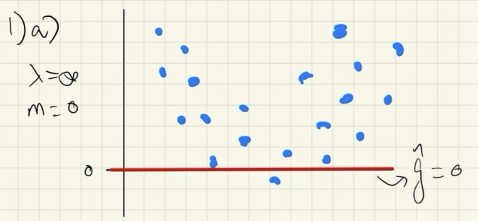
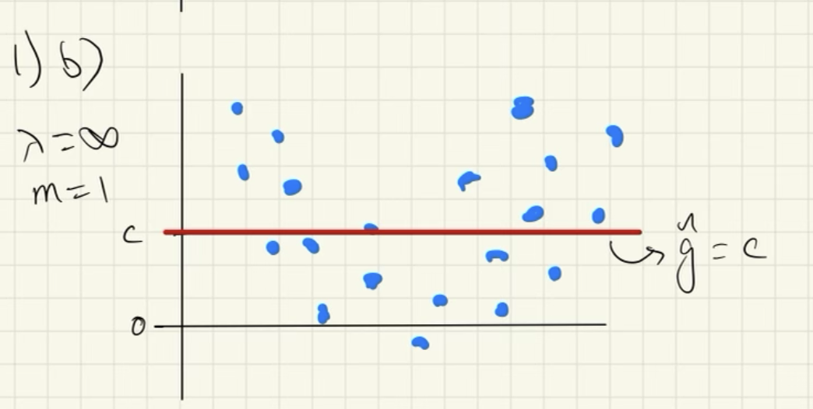
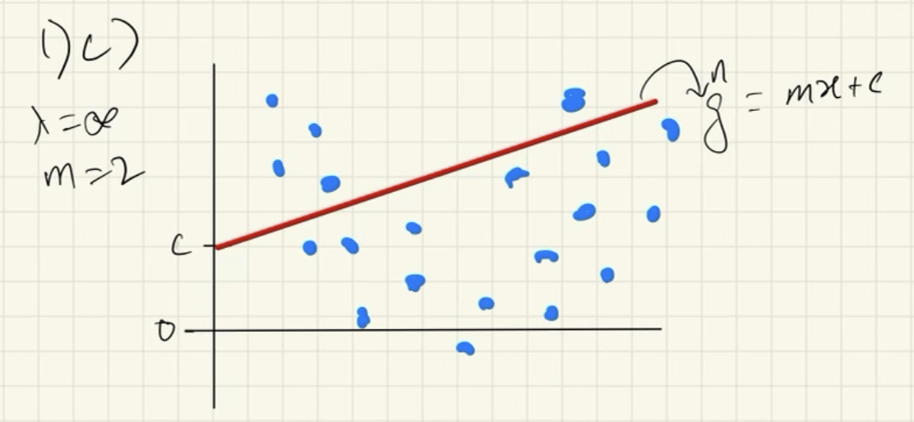
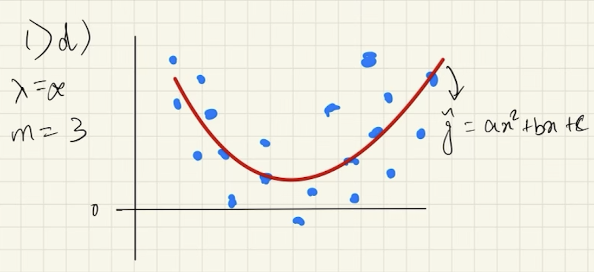
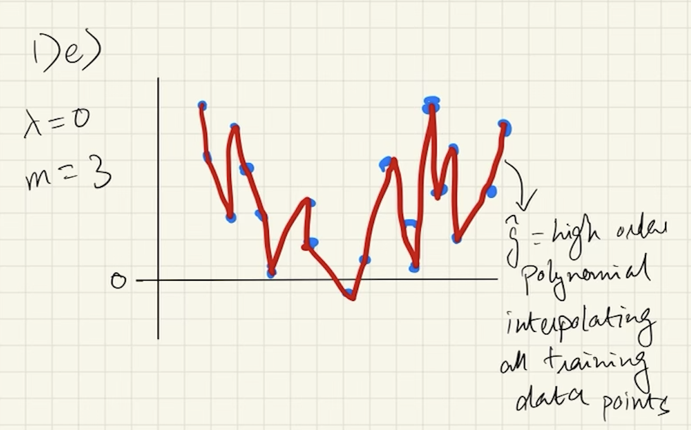

## Instructions:
You may discuss the homework problems in small groups, but you must write up the final solutions and code yourself. Please turn in your code for the problems that involve coding. However, code without written answers will receive no credit. To receive credit, you must explain your answers and show your work. All plots should be appropriately labeled and legible, with axis labels, legends, etc., as needed.

_On this assignment, some of the problems involve random number generation. Be sure to set a random seed (using the command ${\tt set.seed()}$) before you begin._

```{r, setup, message=FALSE}
library(ISLR2)
library(splines)
library(ggplot2)
library(tree)
library(dplyr)
library(gam)
library(randomForest)
```


## 1. Suppose that a curve $\hat{g}$ is computed to smoothly fit a set of $n$ points using the following formula: $$\hat{g} = arg \mathop{min}_g\left(\sum_{i=1}^{n}(y_i - g(x_i))^2 + \lambda \int \left[g^{(m)}(x)\right]^2 \; dx\right),$$ where $g^{(m)}$ represents the $m$th derivative of $g$ (and $g^{(0)} = g$). Provide example sketches of $\hat{g}$ in each of the following scenarios.

Since the penalty is a positive term, the minimum possible value is 0.

### (a) $\lambda = \infty, \; m = 0$.



Since $m=0$ and $\lambda= \infty$, we get the minimum when $\hat{g} = 0$ because the residuals are much smaller than the penalty term. 

### (b) $\lambda = \infty, \; m = 1$.



Since $m=1$ and $\lambda= \infty$, we get the minimum when $\hat{g}' = 0$. We can get this when $\hat{g} = c$ i.e. some constant value because the residuals are much smaller than the penalty term.

### (c) $\lambda = \infty, \; m = 2$.



Since $m=2$ and $\lambda= \infty$, we get the minimum when $\hat{g}'' = 0$. We can get this when $\hat{g} = mx+c$ i.e. a line of slope-intercept form because the residuals are much smaller than the penalty term.

### (d) $\lambda = \infty, \; m = 3$.



Since $m=3$ and $\lambda= \infty$, we get the minimum when $\hat{g}''' = 0$. We can get this when $\hat{g} = ax^2+bx+c$ i.e. a quadratic polynomial because the residuals are much smaller than the penalty term.

### (e) $\lambda = 0, \; m = 3$.



Since $\lambda=0$, we get the minimum when the residuals are zero. This happens when the fitted values perfectly interpolate the training data i.e. the spline has a knot at each training data point.

## 2. Suppose we fit a curve with basis functions $b_1(X) = I(0 \le X \le 2) - (X + 1)I(1 \le X \le 2)$, $b_2(X) = (2X - 2)I(3 \le X \le 4) - I(4 < X \le 5)$. We fit the linear regression model $$Y = \beta_0 + \beta_1b_1(X) + \beta_2b_2(X) + \epsilon,$$ and obtain coefficient estimates $\hat{\beta}_0 = 2$, $\hat{\beta}_1 = 3$, $\hat{\beta}_2 = -2$. Sketch the estimated curve between $X = -2$ and $X = 6$. Note the intercepts, slopes, and other relevant information.

```{r}
seg.df <- data.frame(x=c(-2,0,1,2,3,4,5),xend=c(0,1,2,3,4,5,6),
                     y=c(2,5,-1,2,-6,4,2),yend=c(2,5,-4,2,-10,4,2))

seg.df$slope <- (seg.df$yend - seg.df$y)/(seg.df$xend - seg.df$x)

ggplot(data = seg.df, aes(x,y))+
  geom_segment(aes(xend=xend,yend=yend))+
  geom_text(data = seg.df, aes(x=x+0.5,y=y+1,label=paste0("m = ",slope)))+
  geom_text(data = seg.df, aes(x=x+0.5,y=y+0.4,label=paste0("c = ",-slope*xend+yend)))+
  scale_x_continuous(breaks=seq(-2,6))+
  scale_y_continuous(breaks = seq(-10,10))+
  ggtitle("Sketch of curve")
```

```{r, include = FALSE}
#Cleanup
rm(list = ls())
```

## 3.  Prove that any function of the form $$f(X) = \beta_0 + \beta_1X + \beta_2X^2 + \beta_3X^3 + \beta_4(X - \psi)^3_+$$ is a cubic spline with a knot at $\psi$.

We know

$$
f(X) = \beta_0 + \beta_1X + \beta_2X^2 + \beta_3X^3 + \beta_4(X - \psi)^3_+ =
\begin{cases}
\beta_0 + \beta_1X + \beta_2X^2 + \beta_3X^3 &\text{ if } X \le \psi\\
\beta_0 + \beta_1X + \beta_2X^2 + \beta_3X^3 + \beta_4(X - \psi)^3 &\text{ if } X > \psi\\
\end{cases}
$$


We need to prove the following about $f(X)$ to show that it is a cubic spline:

1. It is continuous

Plugging in the value $X = \psi$ gives us:

$$
f(\psi)=
\begin{cases}
\beta_0 + \beta_1\psi + \beta_2\psi^2 + \beta_3\psi^3\\
\beta_0 + \beta_1\psi + \beta_2\psi^2 + \beta_3\psi^3 + \beta_4(\psi - \psi)^3
\end{cases}
$$

Since we can see that at $X=\psi$ both cases have the same value, we can conclude that $f(X)$ is continuous

2. It is piecewise cubic with a knot at $\psi$

By definition, we can see that $f(X)$ is a function of polynomials upto the third degree. We also see that the definition of the polynomial function defining $f(X)$ changes at $X > \psi$, which is why it is piecewise with a knot at $\psi$

3. Has a continuous 1st derivative

We compute the first derivative and plug in $X=\psi$ in the two cases to check if it is continuous

$$
f'(X) = \begin{cases}
\beta_1 + 2\beta_2X + 3\beta_3X^2 &\text{ if } X \le \psi\\
\beta_1 + 2\beta_2X + 3\beta_3X^2 + 3\beta_4(X - \psi)^2\times1 &\text{ if } X > \psi\\
\end{cases}
$$

We see that on plugging in $X=\psi$ both cases will have the same value

$$
f'(\psi) = \beta_1+2\beta_2\psi+3\beta_3\psi^2
$$

which proves that the first derivative is continuous.

4. Has a continuous 2nd derivative

We compute the second derivative and plug in $X=\psi$ in the two cases to check if it is continuous

$$
f''(X) = \begin{cases}
2\beta_2 + 3\times2\beta_3X &\text{ if } X \le \psi\\
2\beta_2 + 3\times2\beta_3X + 3\times2\beta_4(X - \psi) &\text{ if } X > \psi\\
\end{cases}
$$

We see that on plugging in $X=\psi$ both cases will have the same value

$$
f''(\psi) = 2\beta_2 + 6\beta_3\psi
$$

which proves that the second derivative is continuous.

## 4. For this problem, we will use the ${\tt Wage}$ data set that is part of the ${\tt ISLR}$ package. Split the data into a training set and a test set, and then fit using the following models to predict ${\tt Wage}$ using ${\tt Age}$ on the training set. Make some plots, and comment on your results. 

```{r}
str(Wage)
set.seed(42)
train <- sample(nrow(Wage), size = 0.5*nrow(Wage), replace = FALSE)
```

Defining function to report test MSE, plot test data and model fit.

```{r}
plot.fit <- function(model, subtitle=""){
  agelims <- range(Wage[train, "age"])
  age.grid <- seq(from = agelims[1], to = agelims[2])
  preds <- predict(model, newdata = list(age = age.grid), se = TRUE)
  
  preds.df <- data.frame(age = age.grid, lower = preds$fit - 2*preds$se.fit,
                         upper = preds$fit + 2*preds$se.fit,
                         preds = preds$fit)
  
  test.preds <- predict(model, newdata = Wage[-train,])
  mse <- mean((test.preds - Wage[-train,"wage"])^2)
  print(paste0("Test MSE = ", mse))
  
  ggplot()+
    geom_point(data = Wage[-train,], aes(x=age, y=wage), shape=1, color = "darkgray") +
    geom_line(data = preds.df, aes(x=age, y = lower), linetype = 2, color = "blue")+
    geom_line(data = preds.df, aes(x=age, y = upper), linetype = 2, color = "blue")+
    geom_line(data = preds.df, aes(x=age, y = preds), color = "blue")+
    labs(title = "Plot of Test Data and Model Fit", subtitle = subtitle)
}
```


### (a) polynomial

```{r}
poly.fit <- lm(wage ~ poly(age,4), data = Wage, subset = train)
summary(poly.fit)
plot.fit(poly.fit, "Polynomial model of degree 4")
```

The model summary shows us that a polynomial fit of order 2 might be sufficient to represent the non-linear relationship in the data. The cubic term has a p-value close to 0.05, however, the 4th power is evidently not statistically significant. This model does very well to represent the relationship for most of the range of the data (even for when the number of data points reduces considerably) as we will see.

### (b) step function

```{r}
step.fit <- lm(wage ~ cut(age, 4), data = Wage, subset = train)
summary(step.fit)
plot.fit(step.fit, "Step function with 4 knots")
```

From the summary table we see that the coefficient of the 4th cut in this model is not statistically significant. This is likely because of the sample size in the cut being smaller than the rest. It does not however limit our ability to use coefficient estimates to make predictions.

### (c) piecewise polynomial

```{r}
piecewise.poly.fit <- lm(wage ~ poly(age,4):cut(age,4), 
                         data = Wage, subset = train)
summary(piecewise.poly.fit)
plot.fit(piecewise.poly.fit, "Piecewise Polynomial Model (Discontinuous)")
```

(The different polynomials are joined together as they are a part of a single geom_line layer in the ggplot call. A closer look at the knots shows that it is indeed two polynomials joined together by a line segment)

From the results we see that the confidence interval becomes wider at the upper end of the age scale (similar to other model fits). The discontinuity at the cutpoints is noticeable, which means there will be irregularity in predictions for values of age that are close to the cutpoints. We also notice that the polynomial for the last cutpoint (64.5, 80.1] takes on a very unpredictable shape and has a huge confidence interval, making predictions in this range less reliable.

### (d) cubic spline

```{r}
cubic.spline.fit <- lm(wage ~ bs(age, knots = c(17,33,50,70)), 
                       data = Wage, subset = train)
summary(cubic.spline.fit)
plot.fit(cubic.spline.fit, "Cubic Spline")
```

The cubic spline does a better job of addressing the discontinuities in the piecewise polynomial model, however, it does not fare much better in terms of fit for ages > 70 than the piecewise polynomial model.

### (e) smoothing spline

```{r}
(smooth.spline.fit1 <- smooth.spline(x = Wage[train, "age"], 
                                   y = Wage[train, "wage"],
                                   df = 20))
(smooth.spline.fit2 <- smooth.spline(x = Wage[train, "age"], 
                                   y = Wage[train, "wage"],
                                   cv = TRUE))

spline1 <- data.frame(age = smooth.spline.fit1$x, wage = smooth.spline.fit1$y, 
                      Model = rep("DF = 20", length(smooth.spline.fit1$x)))

spline2 <- data.frame(age = smooth.spline.fit2$x, wage = smooth.spline.fit2$y, 
                      Model = rep("CV (DF = 5.14)", length(smooth.spline.fit2$x)))

ggplot()+
  geom_point(data = Wage[-train,], aes(x=age, y=wage), shape=1, color = "darkgray") +
  geom_line(data =spline1, aes(x=age, y = wage, color = Model), linetype = 1)+
  geom_line(data =spline2, aes(x=age, y = wage, color = Model), linetype = 1)+
  labs(title = "Plot of Test Data and Model Fit", subtitle = "Smoothing Spline")+
  scale_color_manual(values = c("DF = 20" = "blue", "CV (DF = 5.14)" = "red"))

mse.best.spline <- mean((predict(smooth.spline.fit2, x = Wage[-train, "age"])$y -
                        Wage[-train,"wage"])^2)

print(paste0("MSE for best spline (DF = 5.14) = ",round(mse.best.spline,2)))
```

We fit two splines to show the difference in model fit. The model with DF=20 has a very wiggly fit and takes an unpredictable shape for age > 70. The spline fitted using cross-validation does a much better job of following some kind of predictable behavior for all ranges of age.

### (d) Which approach yields the best results on the test set?

The smoothing spline produces the the lowest test error with an MSE of `r round(mse.best.spline,2)`.

```{r, include = FALSE}
#Cleanup
rm(list = ls())
```


## 5. Use the ${\tt Auto}$ data set to predict a car’s ${\tt mpg}$. (You should remove the ${\tt name}$ variable before you begin.)

### (a) First, try using a regression tree. You should grow a big tree, and then consider pruning the tree. How accurately does your regression tree predict a car’s gas mileage? Make some figures, and comment on your results.

```{r}
set.seed(42)
train <- sample(nrow(Auto), 0.5*nrow(Auto), replace = FALSE)

data <- Auto |> select(-name) |> mutate(origin = as.factor(origin))

tree.auto <- tree(mpg ~ ., data = data, subset = train)
summary(tree.auto)
plot(tree.auto)
text(tree.auto, pretty=0)
title("Decision Tree Before Any Pruning")
```

Using cross validation to select the best tree:
```{r}
cv.auto <- cv.tree(tree.auto)
cv.results <- data.frame(size = cv.auto$size, deviance = cv.auto$dev)

ggplot(data = cv.results, aes(x=size, y=deviance))+
  geom_point()+
  geom_line()+
  scale_x_continuous(breaks = seq(0,9))+
  ggtitle("Tree Size vs Deviance", subtitle = "Calculated using cross-validation")
```

Using cross-validation we can see that a tree size of 9 provides the best results.

Let us try a pruned tree:

```{r}
prune.auto <- prune.tree(tree.auto, best = 7)
plot(prune.auto)
text(prune.auto, pretty=0)
title("Pruned decision tree (with 5 leaf nodes)")
```

Now, we compare the results

```{r}
pred.full <- predict(tree.auto, newdata = data[-train,])
mse.full <- mean((pred.full - data[-train, "mpg"])^2)
print(paste("MSE on test set for 9-node tree", round(mse.full,2), sep = " = "))

pred.prune <- predict(prune.auto, newdata = data[-train,])
mse.prune <- mean((pred.prune - data[-train, "mpg"])^2)
print(paste("MSE for test set pruned tree", round(mse.prune,2), sep = " = "))
```

We see that a tree with 9 nodes gives a lower estimated test MSE than a pruned tree with 5 nodes. Cross validation did indeed help us identify the best tree size. The pruned tree does help more with interpretability but comes at the cost of accuracy.

### (b) Fit a bagged regression tree model to predict a car’s ${\tt mpg}$ How accurately does this model predict gas mileage? What tuning parameter value(s) did you use in fitting this model?

Selecting best ntree and nodesize parameter for bagging:
```{r}
ntree <- c(5,10,25,50,100,200,500)

set.seed(42)
val <- sample(train, length(train)/2, replace=FALSE)

nodesize <- seq(5,15)

mse <- matrix(rep(0, length(ntree)*length(nodesize)), 
              nrow = length(ntree), ncol = length(nodesize))

for(i in 1:length(ntree)){
  for(j in 1:length(nodesize)){
    set.seed(42)
    fit <-  randomForest(mpg ~., data = data, subset = setdiff(train,val), 
                         mtry = ncol(data)-1, importance = TRUE,
                         ntree = ntree[i], nodesize = nodesize[j])
    mse[i,j] <- mean((predict(fit, newdata = data[val,]) - data[val, "mpg"])^2)
    # print(paste("ntree =",ntree[i],", nodesize=",nodesize[j],", MSE =",mse[i,j]))
  }
}

min <- which(mse == min(mse), arr.ind = TRUE)
print(paste("Best ntree =",ntree[min[1]]))
print(paste("Best nodesize =",nodesize[min[2]]))
```

```{r}
set.seed(42)

bag.auto <- randomForest(mpg ~., data = data, subset = train, 
                         mtry = ncol(data)-1, importance = TRUE,
                         ntree = ntree[min[1]], nodesize = nodesize[min[2]])
bag.auto

pred.bag <- predict(bag.auto, newdata = data[-train,])
mse.bag <- mean((pred.bag - data[-train, "mpg"])^2)
print(paste("MSE on test set for bagged tree", round(mse.bag,2), sep = " = "))
```

Tuning parameters used (by searching using CV):

- Number of trees (ntrees): `r ntree[min[1]]`
- Minimum size of terminal nodes (nodesize): `r nodesize[min[2]]`

### (c) Fit a random forest model to predict a car’s ${\tt mpg}$ How accurately does this model predict gas mileage? What tuning parameter value(s) did you use in fitting this model?

```{r}
mtry <- seq(1,ncol(data)/2)

mse <- matrix(rep(0, length(ntree)*length(mtry)), 
              nrow = length(ntree), ncol = length(mtry))

for(i in 1:length(ntree)){
  for(j in 1:length(mtry)){
    set.seed(42)
    fit <-  randomForest(mpg ~., data = data, subset = setdiff(train,val), 
                         mtry = mtry[j], importance = TRUE,
                         ntree = ntree[i], nodesize = 10)
    mse[i,j] <- mean((predict(fit, newdata = data[val,]) - data[val, "mpg"])^2)
    # print(paste("ntree =",ntree[i],", mtry=",mtry[j],", MSE =",mse[i,j]))
  }
}

min <- which(mse == min(mse), arr.ind = TRUE)
print(paste("Best ntree =",ntree[min[1]]))
print(paste("Best mtry =",mtry[min[2]]))
```


```{r}
set.seed(42)

rf.auto <- randomForest(mpg ~., data = data, subset = train, 
                         mtry = mtry[min[2]], importance = TRUE,
                         ntree = ntree[min[1]])
rf.auto

pred.rf <- predict(rf.auto, newdata = data[-train,])
mse.rf <- mean((pred.rf - data[-train, "mpg"])^2)
print(paste("MSE on test set for random forest", round(mse.rf,2), sep = " = "))
```

Tuning parameters used (by searching using CV):

- Number of trees (ntrees): `r ntree[min[1]]`
- Variables tried at each split (mtry): `r mtry[min[2]]`

### (d) Fit a generalized additive model (GAM) model to predict a car’s ${\tt mpg}$ How accurately does your GAM model predict a car’s gas mileage? Make some figures to help visualize the fitted functions in your GAM model, and comment on your results.

```{r}
gam.fit <- gam(mpg ~ s(cylinders) + s(displacement) + s(horsepower) +
                 s(weight) + s(acceleration) + s(year) + origin,
               data = data, subset = train)
summary(gam.fit)
par(mfrow=c(2,4))
plot(gam.fit, se=T, col="blue")
```

Let us calculate MSE:
```{r}
pred.gam <- predict(gam.fit, newdata = data[-train,])
mse.gam <- mean((data[-train,"mpg"] - pred.gam)^2)
print(paste("MSE on test set for GAM", round(mse.gam,2), sep = " = "))
```

The summary table of the GAM shows us important information:

- All variables other than origin proved statistically significant in the model fit (as seen in ANOVA for parametric effects)
- The non-linear relationships chosen by the splines were also statistically significant (as seen in ANOVA for non-parametric effects)

### (e) Considering both accuracy and interpretability of the fitted model, which of the models in (a)–(d) do you prefer? Justify your answer.

The Random Forest we generated in (c) gives us the lowest estimated test MSE. However, the GAM in (d) and is much more interpretable in terms of how each predictor is related to the response `mpg`, and has a very slight difference in MSE.

As compared to the bagged tree and random forest models, is able to clearly show how the relation varies with the value of the predictors. For the former models, the best we can do is get a sense of feature importance, but even then we will not know how the feature affects the response for different ranges of values.

On the other hand, GAM gives us some clear insights:

- Cars from `origin=1` (USA) have the lowest MPG
- `mpg` has generally increased with `year`
- increasing `weight` and `horsepower` decrease `mpg` - this decrease slows down when `weight` reaches the 3500 range
- When `cylinders>4`, more cylinders reduce `mpg`. We can also see clearly that even though there is evidence that `cylinder=3` has the lowest `mpg` there are only 3 observations in that group. 

Given the fact that the GAM offers us the ability to understand underlying relationships in data much more clearly without compromising too much on prediction error, it is a great choice. It is noteworthy that the GAM did not require any sort of parameter tuning either as opposed to the tree-based models. If prediction error is a priority without much concern for interpretability, random forest may be a better bet.

```{r, include = FALSE}
#Cleanup
rm(list = ls())
```